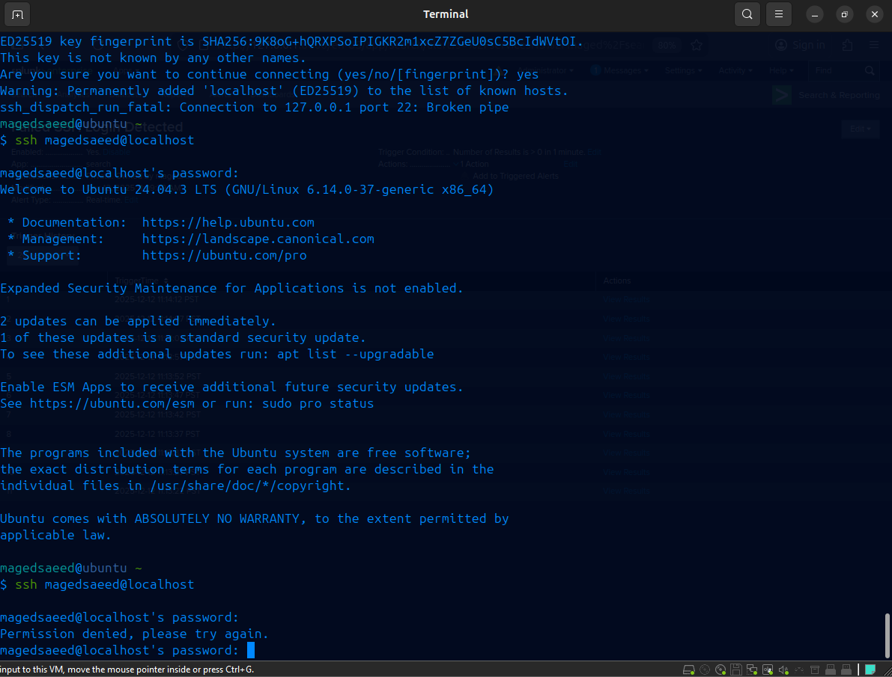
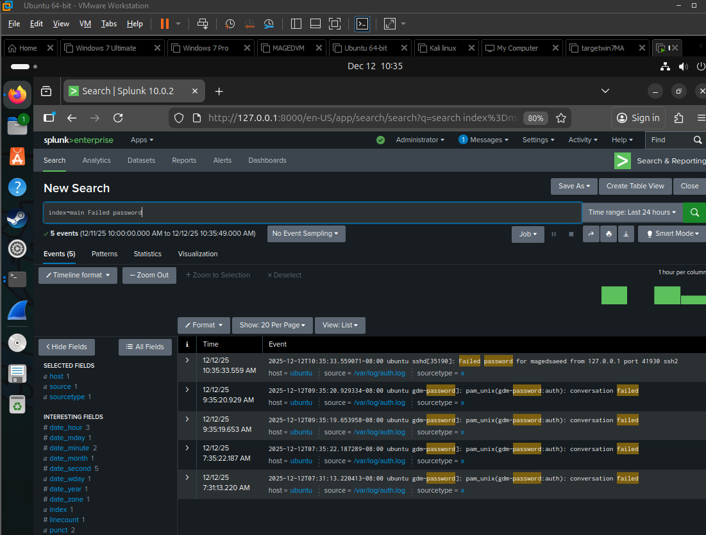

# Splunk Linux Authentication Monitoring

## Overview

This project demonstrates how to build a practical SIEM detection use case in Splunk Enterprise for monitoring Linux authentication activity and detecting failed SSH login attempts in real time.

The lab uses Ubuntu authentication logs as the data source and simulates failed SSH logins to validate log ingestion, detection logic, search capabilities, and alerting functionality.

The project follows a typical SOC workflow:

- Log collection
- Log analysis
- Detection engineering
- Alert creation
- Detection validation

---

## Objectives

- Ingest Linux authentication logs into Splunk
- Monitor SSH authentication activity
- Detect failed SSH login attempts
- Create a real-time alert
- Validate detection using simulated attack activity
- Review alert trigger history

---

## Lab Environment

| Component | Details |
|------------|----------|
| Operating System | Ubuntu Linux 24.04 |
| SIEM Platform | Splunk Enterprise 10.x |
| Service Monitored | OpenSSH Server |
| Log Source | /var/log/auth.log |
| Virtualization | VMware Workstation |

---

## Data Source

Linux authentication events collected from:

```text
/var/log/auth.log
```

Events monitored include:

- Failed SSH password attempts
- PAM authentication failures
- SSH daemon activity
- Authentication-related system events

---

## Detection Logic

### Splunk Search (SPL)

```spl
index=main "Failed password"
```

This query searches authentication logs for failed SSH login attempts generated by the SSH daemon.

---

## Alert Configuration

The detection was converted into a real-time Splunk alert.

### Alert Settings

| Setting | Value |
|----------|---------|
| Alert Type | Real-Time |
| Trigger Condition | Number of Results > 0 |
| Severity | Medium |
| Action | Add to Triggered Alerts |

Whenever a failed SSH login event is detected, the alert automatically triggers and records the event.

---

## Validation Process

To validate the detection:

1. SSH login attempts were performed against the Ubuntu system.
2. Invalid credentials were intentionally entered.
3. Authentication failures were written to `/var/log/auth.log`.
4. Splunk indexed the events.
5. The detection query identified the failed login attempts.
6. The real-time alert was triggered successfully.

---

## Screenshots

### Failed SSH Login Simulation

A failed SSH authentication attempt was generated on the Ubuntu host to simulate suspicious login activity.



---

### Splunk Search Results

Splunk successfully identified failed SSH login events from the authentication logs.



---

### Alert Trigger History

The real-time alert successfully triggered after detecting failed SSH login attempts.


---

## Skills Demonstrated

- Splunk Enterprise
- SIEM Operations
- Linux Log Analysis
- Detection Engineering
- Security Monitoring
- SSH Authentication Monitoring
- Alert Creation and Validation
- SOC Investigation Workflow

---

## Project Outcome

This project demonstrates the complete lifecycle of a basic SIEM detection use case:

- Log ingestion
- Event analysis
- Detection development
- Alert creation
- Detection validation

The result is a working security monitoring solution capable of identifying failed SSH login attempts in real time using Splunk Enterprise.
